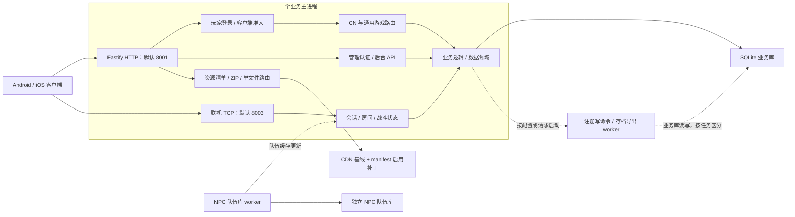

# StarPoint CN 运行架构与排错入口

> 结构核对日期：2026-10-09。依据当前源码、命令定义和已有专项文档；本页描述代码具备的能力及配置条件，不表示某台服务器已启用这些能力或完成部署验收。

先用本页确定问题属于哪个模块，再读取相关代码和专项说明。协议字段、抓包和早期资源格式样例分别见[路由索引](routes/README.md)及[历史协议参考](reference/cn-protocol-legacy.md)。

## 1. 运行关系

运行时为 Node.js 24+、TypeScript/CommonJS，HTTP 使用 Fastify 5，业务库使用 better-sqlite3/SQLite。服务端源码编译到 `out/`；实际启动执行 `out/cn-server.js`。Android 与 iOS 客户端分别包含 AIR/SWF 及对应平台载荷。

图中列出主要路径；导出 worker 对业务库只读，NPC worker 使用独立队伍库，其他线程职责见第 4 节。房间、socket 和实时会话仍在主进程内，增加 HTTP 进程需要另行解决这些共享状态与写入一致性。

## 2. 模块地图

| 模块 | 当前入口 | 负责什么 |
| --- | --- | --- |
| 服务装配与生命周期 | [src/cn-server.ts](../src/cn-server.ts) | 注册解析器、认证/准入 hook、路由、静态资源、任务与 TCP 服务；处理启动就绪和关闭 |
| 玩家登录与准入 | [playerLogin.ts](../src/routes/cn/playerLogin.ts)、[player-login.ts](../src/lib/player-login.ts)、[client-admission.ts](../src/lib/client-admission.ts) | 玩家身份和登录会话、客户端准入；与管理后台认证分别处理 |
| 游戏 API | `src/routes/cn/`、`src/routes/api/` | CN 专属协议及通用养成、抽卡、任务、单人/多人结算等入口 |
| 联机与 NPC | `src/multi/`，从 [multi/index.ts](../src/multi/index.ts) 定位 | TCP、房间、编队、战斗事实、恢复和结算；休息室状态另见 `src/lounge/` |
| 数据库与存档 | [data/index.ts](../src/data/index.ts)、[data/db.ts](../src/data/db.ts)、`src/data/domains/`、`src/data/snapshots/` | 初始化/迁移、共享连接、业务领域与玩家存档分类、导入导出 |
| 服务端内容表 | [assets.ts](../src/lib/assets.ts)、[content-master.ts](../src/lib/content-master.ts)、[content-snapshot.ts](../src/content/runtime/content-snapshot.ts) | 读取 `assets/` 业务表、CDN 派生表和按需内容快照；实际覆盖顺序由各 accessor 决定 |
| 客户端资源下发 | [asset.ts](../src/routes/cn/asset.ts)、[version.ts](../src/lib/version.ts)、[custom-cdn-resource-routes.ts](../src/lib/custom-cdn-resource-routes.ts) | 目标版本、设备下载清单、发布补丁与按哈希请求的资源 |
| 管理后台 | `admin/src/`、`src/routes/web_api/`、[modAdmin.ts](../src/routes/api/modAdmin.ts) | React 管理界面、旧管理页面及管理 API；界面构建到 `web/dist/` 后由 `/admin/` 服务 |
| 客户端工具 | [client-patch/AGENTS.md](../client-patch/AGENTS.md)、[MOD 工具入口](../tools/fantasy-gauntlet-mod-tools/README.md) | 平台输入登记、SWF/ABC/AOT 与资源制作流程；平台成品、资源和服务端代码分层核对 |

管理后台已经接入 CN 服务。`web/dist/index.html` 存在时启用 React SPA，旧 Web 页面仍保留；不能据此推定当前机器已经构建或开放该界面。

## 3. 启动、请求与就绪

1. `cn-server.ts` 装配主数据库及业务模块，安装管理认证、玩家登录、客户端准入和兼容 hook，注册游戏、后台及资源路由。
2. 根据配置启动特定 worker；绑定 HTTP 后启动定时任务和联机 TCP。HTTP 的默认地址为 `127.0.0.1:8001`，TCP 默认为 `0.0.0.0:8003`，实际值分别取 `CN_LISTEN_HOST/PORT` 与 `SESSION_HOST/PORT`。
3. HTTP 与 TCP 都绑定成功后写入 `.logs/cn-server-ready.json`。`.logs/cn-server-current.json` 是日志收集器的进程/文件回执，不能单独证明两个监听器已经就绪；就绪文件也不替代客户端准入等必要配置成功加载的证据。
4. 正常关闭先停止 TCP 接收和定时任务，再排空持久化及 writer 队列，关闭相关 worker，并移除就绪文件。

普通游戏 HTTP 请求通常采用 Base64 包装的 MessagePack；表单解析器同时保留普通表单/JSON 兼容。输出由 [cn-response-hook.ts](../src/lib/cn-response-hook.ts) 按响应类型编码，`/load` 的 HTTP 压缩和响应线程池另受配置控制。管理 API、版本文件和静态下载有各自格式，排查时以目标路由为准。

| 操作或证据 | 入口与边界 |
| --- | --- |
| 构建服务端 | `npm run build` 编译到 `out/` 并生成 CSS；`dev:cn` 会先构建 |
| Windows 日志启动 | [start-cn-logged.ps1](../scripts/start-cn-logged.ps1) 使用已有生成物，通过日志收集器启动；就绪依据仍取上述监听/就绪记录 |
| 类型检查 | `npm run typecheck` 只覆盖 `src/**/*.ts`，可能更新 incremental 信息；不覆盖 React 后台 |
| 后台构建 | `build:admin` 包含依赖安装和后台构建，不能当作无副作用的检查 |
| 日志 | 默认日志入口按 UTC+08:00 的四小时日历窗口合并 stdout/stderr；详情见[四小时日志](development/SERVER-FOUR-HOUR-LOGS-20261005.md)与[诊断模式](development/server-diagnostics-modes.md) |

代码存在、生成物存在、进程启动、监听就绪和具体功能验收是不同证据。部署范围与操作顺序见[开发与交付流程](development/branch-workflow.md)。

## 4. 数据与线程归属

业务库由主进程初始化和迁移，领域模块通过共享连接或指定 override 连接读写。SQLite 使用 WAL；经过持久化协调器的操作有排队与事务控制，直接同步领域调用仍需核对实际调用路径。

| 执行单元 | 当前职责 | 启用/归属边界 |
| --- | --- | --- |
| 业务主进程 | HTTP、socket、房间、实时会话及大量业务计算/读写 | 保留进程内状态；不能直接复制成无状态 HTTP cluster |
| 注册命令 writer | 已登记业务命令、事务与组提交 | `CN_WRITER_THREAD` 代码默认关闭；只覆盖 [commands.ts](../src/lib/persistence/commands.ts) 注册的路径，不能概括为所有业务写入 |
| SQL persistence worker | 协调器委派的特定 SQL 命令 | `SQLITE_PERSISTENCE_WORKER` 默认关闭；与 writer 是不同执行路径 |
| checkpoint worker | WAL 维护与自动 checkpoint 所有权切换 | 默认跟随多核配置，四核及以上默认启用多核，可显式覆盖；不承担游戏结算 |
| 响应线程池 | 特定响应编码和压缩任务 | `CN_RESPONSE_WORKERS` 默认 0；主线程的计算与 MessagePack 成本不能全部归入 worker |
| NPC 队伍库 worker | 独立 `quest_ai_party_pool.db` 的筛选与持久化，向主进程发送队伍缓存更新 | 实时房间和本局出战快照仍在主进程路径核对 |
| 存档导出 worker | 单个只读事务中的一致玩家快照，关库后序列化 | 按请求创建，最多一个并行导出；并非复制整个数据库文件 |

配置定义见 [multicore-config.ts](../src/lib/multicore-config.ts)、[writer-config.ts](../src/lib/persistence/writer-config.ts) 与 [sqlite-persistence-worker.ts](../src/lib/sqlite-persistence-worker.ts)。实现和已覆盖路径见[单写线程记录](development/SQLITE-WRITER-THREAD-20261003.md)；[多核记录](development/MULTICORE-CPU-OPTIMIZATION-20261002.md)含历史基准，不能据其旧配置推定当前服务器的实际开关。

存档修改从 [player-snapshot.ts](../src/data/snapshots/player-snapshot.ts) 的分类与事务入手；导出、导入、自动备份、账号身份及共享关系分别核对。运行数据库默认位于 `.database/`，数据和环境配置独立于源码版本。

## 5. 三类内容来源

| 来源 | 消费方与有效内容 | 排查要点 |
| --- | --- | --- |
| `assets/` JSON 业务表与派生表 | 服务端 accessor 或内容快照读取 | 核对实际 base/extension 合并顺序；编辑单个 JSON 不保证它是最终获胜数据源 |
| CDN 基线 + 发布增量 | 客户端 master 表、图像、声音和动画资源 | `active/` 存放不等于发布；只由 manifest 中启用且匹配发布类型的记录/chain 进入下载清单 |
| 平台客户端载荷 | UI、解析器、运行机制与平台实现 | 先通过平台登记选择输入；服务端或静态表修改不能证明 SWF/ABC/AOT 的行为已改变 |

资源主链为基础 full → CDN diff → manifest 指定的 active 补丁；同名资源后应用覆盖先应用。服务端根据设备 `RES_VER`、平台和目标版本生成所需任务：首次包含基础 full 与适用差分，更新只取后续差分；版本已对齐且没有下载任务时 `full`、`diff` 为 `null`。

目标版本由 CDN 差分和启用补丁推导，`CN_RES_VERSION` 已废弃；`/load.available_asset_version` 取有效目标版本。`manifest.depends_on` 是发布依赖，不是设备当前版本。下载数量、大小和具体版本应从当前清单/请求取证，不能固定为历史样例中的包数。

按哈希直接读取单文件还有独立 HTTP 路由：四个平台根下先找 `assets/asset-patch/production/`，再回退 pristine CDN。这是单文件服务的优先级，不替代 ZIP/manifest 发布链；交付时另遵循包范围规则。

机制细节见[CDN 总览](cdn/overview.md)、[排查手册](cdn/debugging.md)。[客户端下载逆向](cdn/client-flow.md)基于历史反编译树，使用其具体机制时应匹配所选当前客户端。Android public/LAN 与 iOS 输入从[平台工作入口](../client-patch/AGENTS.md)定位；`accepted_offline`、用户设备验收和云服部署分别取证。

## 6. 从症状选择入口

| 现象 | 首先读取 | 验证重点 |
| --- | --- | --- |
| 无法登录、反复回标题、准入失败 | 玩家登录/准入 hook、对应路由和同时间窗口日志 | 身份、会话、准入配置加载与配对；端口已监听不证明准入可用，需要客户端身份时再进入平台流程 |
| 联机掉线、卡准备/续战、重复或缺失结算 | `src/multi/` 调用栈、[多人稳定性记录](development/MULTIPLAYER-STABILITY-CONSOLIDATED-20261004.md)、[结算诊断](development/server-settlement-reliability.md) | HTTP 与 TCP 阶段、本局事实快照、结算归属、队列和事务 |
| 角色、奖励、池子、商店数据不符 | 相关 route/domain 与实际 `assets.ts` accessor | 获胜数据源、结算规则及存档引用；客户端显示另核对有效 master |
| 资源不更新、图像/动效缺失 | `asset.ts`、`version.ts`、manifest 与请求 `RES_VER/device` | 发布清单、平台资源、覆盖顺序和加载器；图像能单独下载不证明 UI 已预加载 |
| 存档导出/导入失败或数据丢失 | 快照分类、导出 worker、导入 route/domain | 非空数据、级联、身份保留、V1/V2、失败回滚；写入场景使用隔离库 |
| 后台打不开或管理 API 失败 | `admin/`、管理认证、Web 路由与 `web/dist/` | 区分生成物、认证、API 和浏览器行为；根类型检查不覆盖后台 |
| CPU、内存、卡顿或写入排队 | 性能摘要、SQLite diagnostics 与相关 worker 配置 | 先确认实际开关、主线程热点、队列/事务；再选对应基准或回归 |

验证选能覆盖原症状和受影响回归的现有检查。源码、资源、环境及结果未变化时复用有效证据；静态检查、隔离测试、实际服务、设备和生产验收分别记录，不要求每个问题都走发布全套流程。

## 7. 文档维护

- 服务装配、状态/线程归属、数据来源、发布链或关键入口改变时，更新本页对应段落和入口；纯数值/文案变化通常只维护专项资料。
- 保留实际代码链接和核对日期。环境开关、端口、资源版本、客户端身份和部署状态从当前对象取值，不在总览中登记“永久最新值”。
- 专项文档保存详细机制、验证和回滚；本页保留定位所需信息。历史参考只用于匹配输入的兼容调查，不作为当前运行状态。
