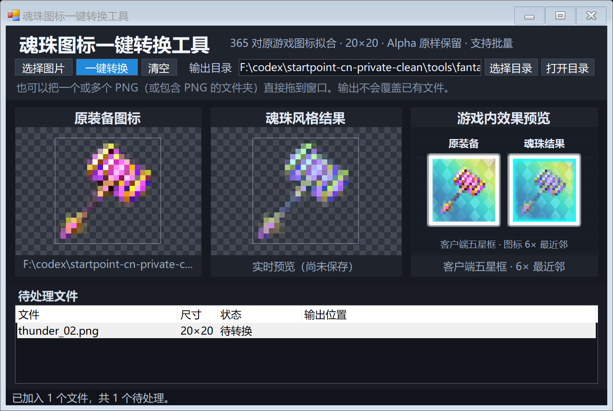

# 魂珠图标一键转换工具

这是随 StarPoint CN 服务端仓库提供的一个**独立 Windows 桌面工具**，用于把世界弹射物语常见的 `20×20` 装备 PNG 转换成魂珠配色，并在保存前预览游戏内图标格效果。

它不属于服务端运行链路：启动服务端不会自动运行本工具，本工具也不会连接数据库、修改服务端数据、写入客户端或游戏目录。



## 功能

- 单张或批量导入 `20×20 PNG`，也可拖入包含 PNG 的文件夹。
- 选择图片后立即显示原装备图标和实时魂珠结果，不需要先保存。
- 使用客户端原始五星装备框、魂珠内框及 `6×` 最近邻规则预览游戏内效果。
- 转换时逐像素保留 Alpha；同一输入每次得到相同结果。
- 输出不会覆盖已有文件；重名时自动追加 `_2`、`_3` 等序号。
- 支持无界面命令行转换，便于接入其他本地资源流程。

## 直接使用

构建完成后双击：

```text
tools\soul-icon-converter\dist\魂珠图标一键转换工具.exe
```

界面操作：

1. 点击“选择图片”，或把一个或多个 PNG/文件夹拖入窗口。
2. 在三栏预览区检查原图、魂珠配色和游戏内五星图标格。
3. 选择输出目录。
4. 点击“一键转换”。

默认输出名为 `原文件名_魂珠.png`。

## 输入规格

| 项目 | 要求 |
|---|---|
| 格式 | PNG |
| 尺寸 | `20×20` 像素 |
| 透明度 | 支持透明及半透明像素，Alpha 原样保留 |
| 推荐内容 | 原游戏风格的装备像素图 |

尺寸不符的文件会进入列表并标记为“尺寸不符”，转换时会明确失败，不会静默缩放或裁切原图。

## 游戏内预览说明

- 左侧“原装备”使用客户端五星装备底框。
- 右侧“魂珠结果”在五星底框上额外使用客户端魂珠内框。
- 图标本体按客户端规则从 `20×20` 以最近邻放大 `6×`，居中进入 `168×168` 图标格。
- 预览只在工具窗口内合成，不会写入客户端资源；完整游戏详情页并不由本工具模拟。

## 构建

环境：Windows 10/11，系统需提供 .NET Framework C# 编译器。无需安装 Visual Studio，也不需要原始游戏资源。

在仓库根目录运行：

```powershell
powershell -ExecutionPolicy Bypass -File .\tools\soul-icon-converter\build.ps1
```

输出位置：

```text
tools\soul-icon-converter\dist\
├── 魂珠图标一键转换工具.exe
└── 使用说明.txt
```

`SoulColorModel.g.cs` 和 `GamePreviewAssets.g.cs` 已随源码提交，正常构建不需要 Node.js，也不需要访问网络。

## 命令行用法

```powershell
& '.\tools\soul-icon-converter\dist\魂珠图标一键转换工具.exe' `
  --convert '.\输入.png' '.\输出_魂珠.png'
```

成功时进程退出码为 `0`；失败时为 `1`，并尝试在输出路径旁生成 `.error.txt` 错误记录。

## 转换方式

颜色模型由 365 对原游戏装备/魂珠图标拟合而来。每个像素坐标使用独立的 RGB 仿射模型，透明度通道不参与颜色拟合并保持不变。模型元数据见 [`model-metadata.json`](./model-metadata.json)。

该方法适合原游戏常见的像素装备绘制方式。若输入使用完全不同的光照、描边或色彩体系，结果可能仍需人工微调。

## 文件说明

| 文件 | 用途 |
|---|---|
| `MainForm.cs` | 主窗口、批量队列及实时预览逻辑 |
| `SoulTransformer.cs` | 确定性魂珠配色转换 |
| `PixelPreviewBox.cs` | 原图/结果的最近邻像素预览 |
| `GamePreviewBox.cs` | 客户端五星装备格和魂珠格预览 |
| `SoulColorModel.g.cs` | 已生成的颜色模型 |
| `GamePreviewAssets.g.cs` | 已嵌入的客户端图标框素材 |
| `build.ps1` | 单文件 EXE 构建脚本 |
| `使用说明.txt` | 面向最终使用者的简明说明 |

## 安全边界

- 全程离线运行，不上传图片。
- 不读取或修改服务端数据库。
- 不写入游戏客户端和 CDN 目录。
- 仅在用户选择的输出目录生成 PNG。

本工具用于学习、研究及你有权处理的本地/私服资源工作流。
